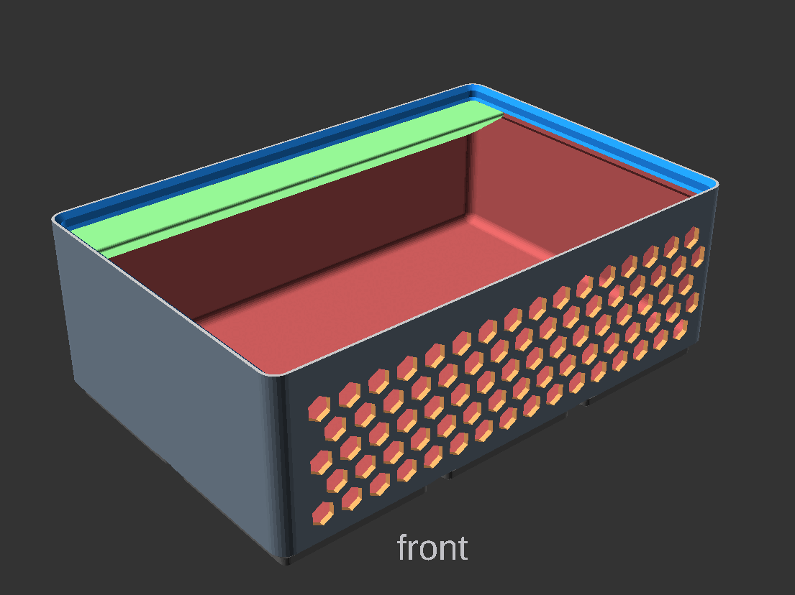

# Navigation Structure
{: .no_toc }

  

    Table of contents
  

  {: .text-delta }
- TOC
{:toc}

# General Cup Settings

## width
X dimension in grid units  (multiples of 42mm)
options [ 0.5, 1, 2, 3, 4, 5, 6, 7, 8, 9, 10, 11, 12, 13 ]

## depth
Y dimension in grid units (multiples of 42mm)
options [ 1, 2, 3, 4, 5, 6, 7, 8, 9, 10, 11, 12, 13 ]

## height
Height in grindfinity height units (7mm) of the bin. Does not include the base height.

## filled_in
Fill in solid block (overrides all following options). Usefull for generating a block to be later modified in OpenSCAD or exported and modified in another tool.
`default = false`

## label

Include overhang for labeling. options are ["disabled", "left", "right", "center", "leftchamber", "rightchamber", "centerchamber"]
`default=disabled`

## labelWidth
 Width of the label in number of fridfinity units (42mm), or zero means full width.

## Wall thickness
thickness of the bin walls, Zack's design is 0.95, `default = 0.95`

## lip_style

Removes some or all of lip options [ "normal", "reduced", "none" ].
`default = "normal"`

# Subdivisions

# chambers
Number of chambers in the X dimention, smallest value is 1, which means no deviders.

## irregular_subdivisions 
Enable irregular subdivisions, `default = false`

## separator_positions
Separator positions are defined in terms of grid units from the left end. example `[0.25, 0.5, 1, 1.33, 1.66]`

# Base
## magnet_diameter
Zack's design uses magnet diameter of 6.5. 0 would disable the magnet hole.

## screw_depth
Zack's design uses depth of 6. 0 would disable the screw hole.

## hole_overhang_remedy
Hole overhang remedy is active only when both screws and magnets are nonzero (and this option is selected)

## box_corner_attachments_only 
Only add attachments (magnets and screw) to box corners (prints faster).
'default = false'

## floor_thickness 
Minimum thickness above cutouts in base (Zack's design is effectively 1.2) `default = 0.7`

## efficient_floor
Efficient floor option saves material and time, but the internal floor is not flat (only applies if no magnets, screws, or finger-slide used).
`default = false`

## half_pitch
Enable to subdivide bottom pads to allow half-cell offsets
`default = false`

## flat_base
Removes the base grid from inside the shape
`default = false`

# Finger Slide
## fingerslide
Include larger corner fillet, to allow easy removal of the items in the bin.
`default = true`

## fingerslide_radius
Radius of the corner fillet, `default = 8`

# Tapered Corner
## tapered_corner
style of the tapered corner. options none, rounded, champhered

## tapered_corner_size
default = 10;

## tapered_setback
Set back of the tapered corner, default is the gridfinity corner radius
 = -1;//gridfinity_corner_radius/2;

# Wall Cutout
## wallcutout_enabled
`default=false`

## wallcutout_walls
wall to enable on, front, back, left, right.
=[1,0,0,0]; 

## wallcutout_width=0;
default will be binwidth/2

## wallcutout_angle
default = 70 deg

## wallcutout_height
default will be binHeight

## wallcutout_corner_radius
default = 5

---
# Wall Pattern

## wallpattern_enabled
Enables a grid pattern to be removed from the walls of the bin.`default=false`

## wallpattern_hexgrid
Switches between a square and hex pattern `default=true` which is hex.

## wallpattern_walls
Selects the walls to enable the wall pattern on. [front, back, left, right].
I.E. [1,0,0,0] front only, [1,1,1,1] all walls.

## wallpattern_fill
The pattern wont fill the space completly. These options allow for extending the patter to fill the space.
 - "none", no fill.
 - "space", Increase Space between grid to fill
 - "crop", Over fill and crop the the allowed space.

## wallpattern_hole_sides
Number of sides of the hole op
 = 6; //[4:square, 6:Hex, 64:circle]

wallpattern_hole_size
Size of the hole

## wallpattern_hole_spacing
Spacing between pattern
