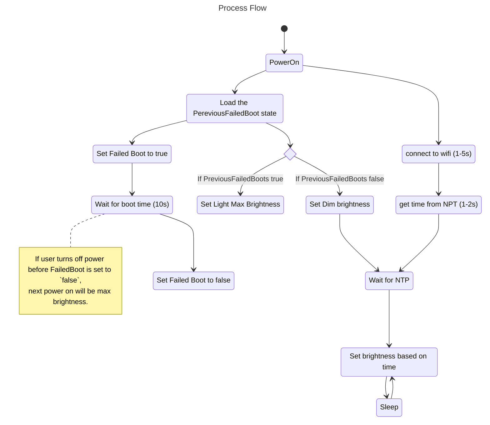

Script to auto set the brightness of a light based on the time of day.

Features:
 - Brightness to be based on time of day
 - Light to be switched via mains switch
 - On power on, light needs to get time time from NTP, then set brightness
 - Dim light is needed while its gets the current time (4-6s)
 - Ability to force max brightness using mains switch


---

# Firmware
https://github.com/openshwprojects/OpenBK7231T_App


# Script
To be save in the `OpenBK7231T` autoexec.

```
startDriver ntp
ntp_timeZoneOfs 10:00

//Override dynamic control on fast reboot (mains off and on)
//To trigger turn on for less than configured failed boot time(default 5s), off for 2s, on again.
if $failedBoots>=2 then goto override 

echo setting up dynamic lighting. failedBoots $failedBoots uptime $uptime
alias day_lights backlog led_temperature 200; led_dimmer 100; echo lights_day_lights
alias evening_lights backlog led_temperature 500; led_dimmer 50; echo lights_evening_lights 
alias night_lights backlog led_temperature 500; led_dimmer 25; echo lights_night_lights

//Timed events for auto switching when leaving the light on
addClockEvent 06:00 0xff 1 day_lights 
addClockEvent 19:00 0xff 2 backlog evening_lights 
addClockEvent 22:00 0xff 3 backlog night_lights

//set initial value while we wait
backlog led_temperature 500; led_dimmer 20; led_enableAll 1;

//Wait for NTP to set up and retrieve current time value
waitFor NTPState 1
if $hour>=06&&$hour<19 then day_lights
if $hour>=19&&$hour<22 then evening_lights
if $hour>=22||$hour<06 then night_lights
goto end

override:
echo overriding dynamic light, setting to max brightness, let there be light. failedBoots $failedBoots uptime $uptime
backlog led_temperature 154; led_dimmer 100; led_enableAll 1;

end:
echo autoexec done. failedBoots $failedBoots, uptime $uptime, NTPOn $NTPOn, time $day $hour $minute $second
```