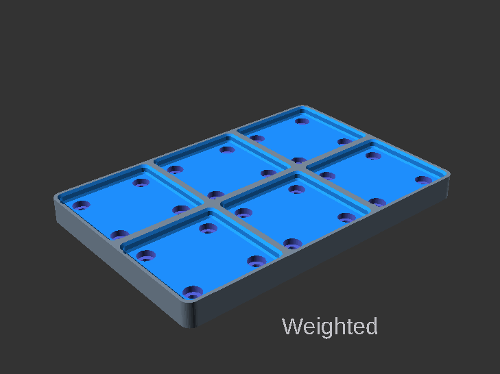
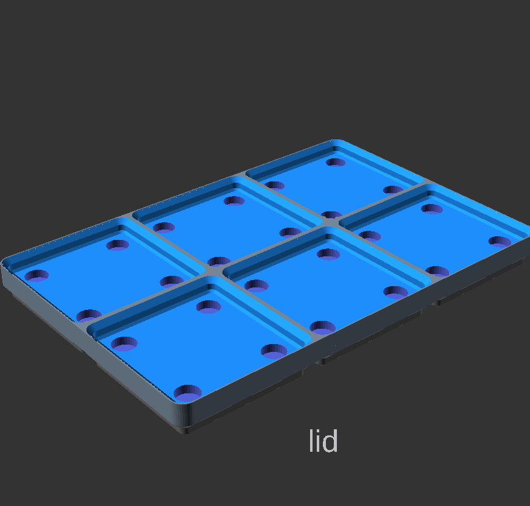
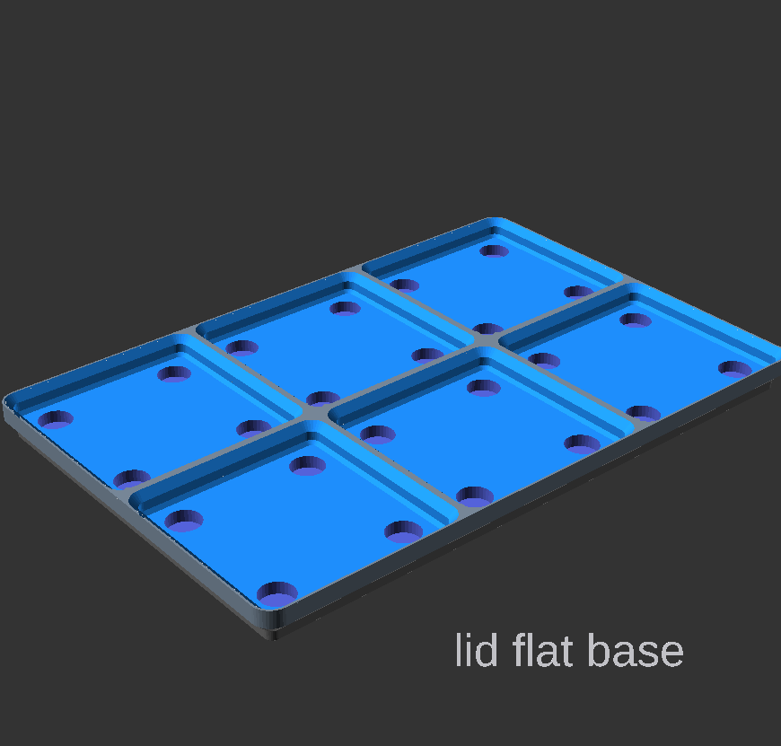
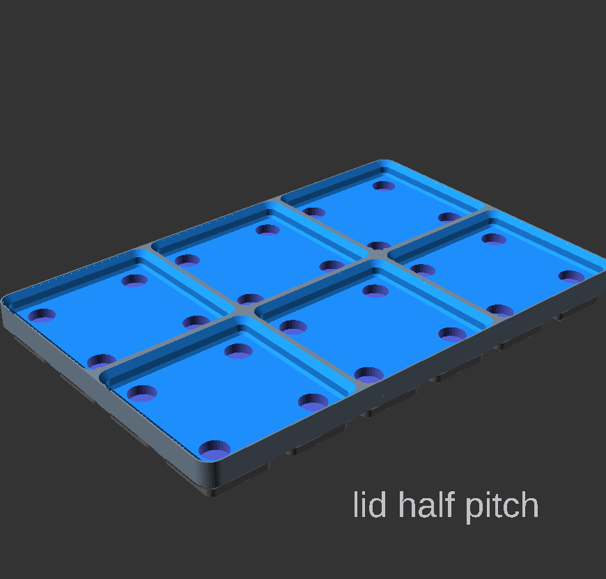

# Navigation Structure
{: .no_toc }

  

    Table of contents
  

  {: .text-delta }
- TOC
{:toc}

# Base Plate Settings
 
Setting | Description
-|-
`width` | X dimension in grid units  (multiples of 42mm) `[ 0.5, 1, 2, 3, 4, 5, 6, 7, 8, 9, 10, 11, 12, 13 ]`
`depth` | Y dimension in grid units (multiples of 42mm) `[ 1, 2, 3, 4, 5, 6, 7, 8, 9, 10, 11, 12, 13 ]`
`weighted` |  Allow space for weighted inserts
`lid` |  A lid that is also a Gridfinity base
`lid_flat_base` |  Removes the internal grid from base the lid
`lid_half_pitch` |  Adds half pitch grid to the base of the lid