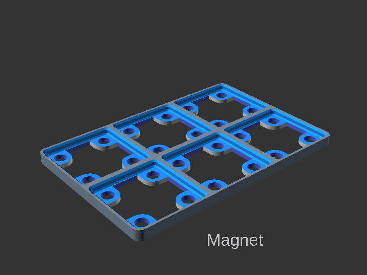
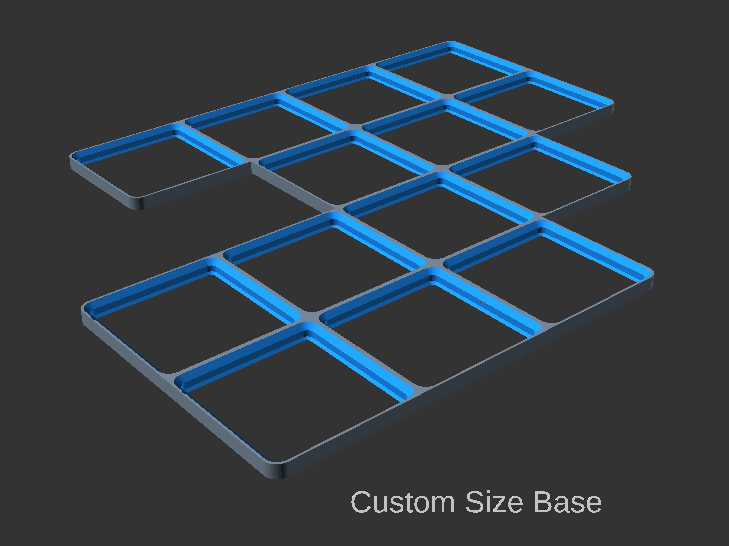

# Navigation Structure
{: .no_toc }

<details open markdown="block">
  <summary>
    Table of contents
  </summary>
  {: .text-delta }
- TOC
{:toc}
</details>

# Base Plate Settings
<BR>
Setting | Description
-|-
`Width` | X dimension in grid units  (multiples of 42mm)<br>`[ 0.5, 1, 2, 3, 4, 5, 6, 7, 8, 9, 10, 11, 12, 13 ]`
`Depth` | Y dimension in grid units (multiples of 42mm)<br>`[ 1, 2, 3, 4, 5, 6, 7, 8, 9, 10, 11, 12, 13 ]`
`Plate_Style` | The style of the plate to generate.<br>**Options** <br>`base`: Base plate to go under gridfinity bins.<br>`lid`:Lid Plate, that go on a Gridfinity bin and is also a base 
`Base_Plate_Options` | Options for the **base plate**.<br>**Options**<br><br>`default`:Default, simple base grid<br><BR>`Magnet`:Efficient magnet base, <br><br>`Weighted`: Thicker base with space for weights
`Lid_Options` | Options for the **lid plate**<br>**Options**<br><br>`default`: Lid that is also a Gridfinity base<br><br>`flat`: Removes the internal grid from base the lid<BR><br>`halfpitch`: Adds half pitch grid to the base of the lid
`Custom_Grid_Enabled`| Enables custom base plate shapes. This can only be done by the script. This only works for the Base plate not the lid.

# Size Customisation
The `Custom_Grid_Enabled` allows for creating custom grid patters. To enable this you must first enable the `Custom_Grid_Enabled` flag and then configure the xpos1 to xpos7 variables in the script.

The xpos1 to xpos7 variables are arrays where each value represents a single Gridfinity cell. The number in the array will define how the cell is represented. The script does not workout of the corners should be rounded or square cut this is up to the user.

- `0`: The cell is off
- `1`: The cell is on, and all corners will be rounded.
- `2-16`: are bitwise values used to calculate what corners of the cell should be rounded or square cut. Bitwise logic is used to perform the calculation, 1 must be subtracted from the value for the bitwise logic to make work, this allows 0 and 1 to turn the cell on and off
  -   [4,3,2,1] The that relates to the bitwise value
  - 2 [0,0,0,1] corner 1 square
  - 3 [0,0,1,0] corner 2 square
  - 4 [0,0,1,1] corner 1,2 square
  - 5 [0,1,0,0] corner 3 square
  - 6 [0,1,0,1] corner 1,3 square
  - 7 [0,1,1,0] corner 1,2 square
  - 8 [0,1,1,1] corner 1,2,3 square
  - 9 [1,0,0,0] corner 4 square
  - 10 [1,0,0,1] corner 1,4 square
  - 11 [1,0,1,0] corner 2,4 square
  - 12 [1,0,1,1] corner 1,2,4 square
  - 13 [1,1,0,0] corner 3,4 square
  - 14 [1,1,0,1] corner 1,3,4 square
  - 15 [1,1,1,0] corner 2,3,4 square
  - 16 [1,1,1,1] corner 1,2,3,4 square

I am not sure it this is really useful, but its possible and was fun to code, so here we are.

**Example**<br>
<br>
```
xpos1 = [3,4,0,0,0,0,0];
xpos2 = [2,2,0,5,0,0,0];
xpos3 = [6,2,2,2,0,0,0];
xpos4 = [0,6,2,2,0,0,0];
xpos5 = [0,0,6,10,0,0,0];
xpos6 = [0,0,0,0,0,0,0];
xpos7 = [0,0,0,0,0,0,0];
```