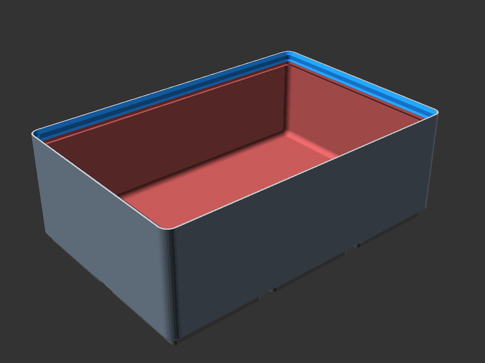
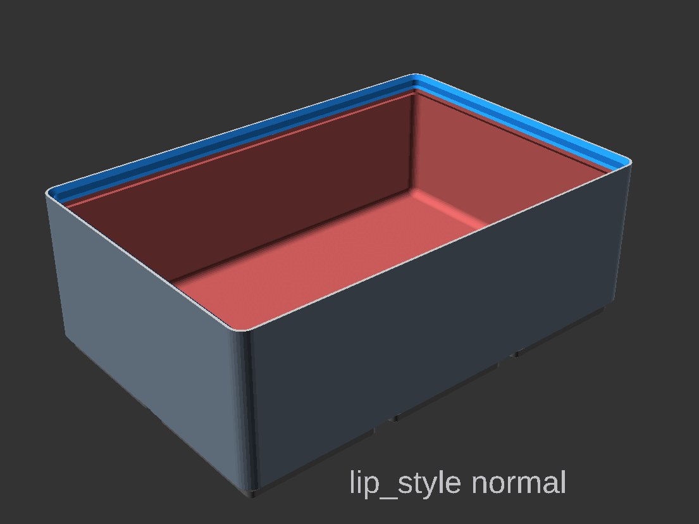
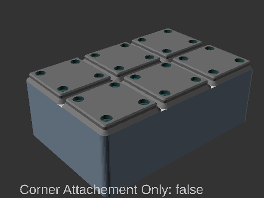
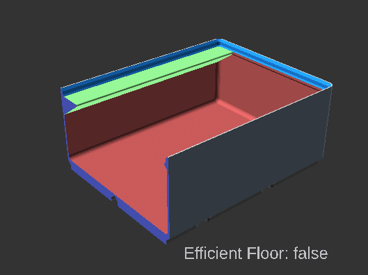
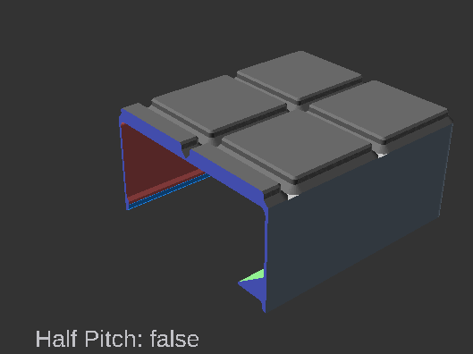
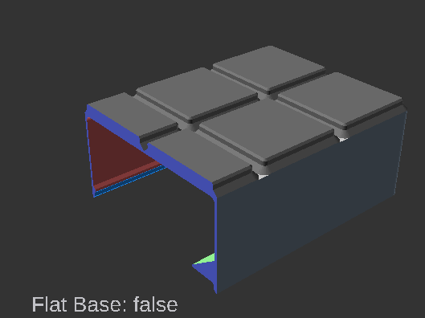
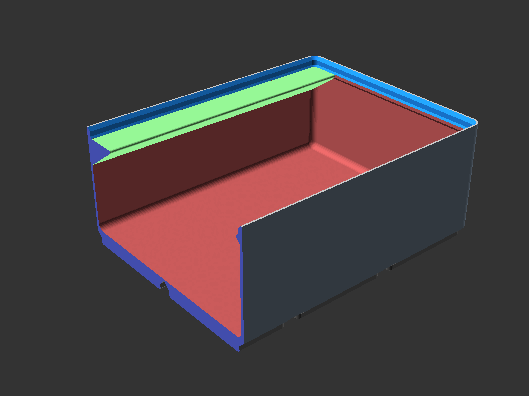
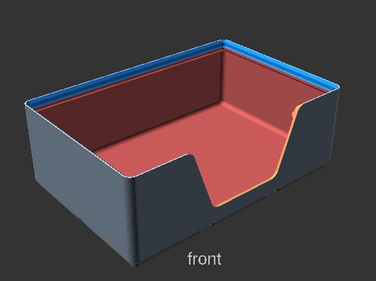

# Navigation Structure
{: .no_toc }

  

    Table of contents
  

  {: .text-delta }
- TOC
{:toc}

# General Cup Settings

Setting | Description
-|-
`width` | X dimension in grid units  (multiples of 42mm) options `[ 0.5, 1, 2, 3, 4, 5, 6, 7, 8, 9, 10, 11, 12, 13 ]`
`depth` | Y dimension in grid units (multiples of 42mm) options `[ 1, 2, 3, 4, 5, 6, 7, 8, 9, 10, 11, 12, 13 ]`
`height` | Height in Gridfinity height units (7mm) of the bin. Does not include the base height.
`filled_in` | Fill in solid block (overrides all following options). Useful for generating a block to be later modified in OpenSCAD or exported and modified in another tool. `default = false`
`label` |  Include overhang for labeling.  `default=disabled` Options 
<ul><li>`disabled`, no label</li><li>`left`, Left aligned</li><li>`right`, Right aligned</li><li>`center`, Center aligned</li><li>`leftchamber`, One label per chamber, left aligned</li><li>`rightchamber`, One label per chamber, right aligned</li><li>`centerchamber`, One label per chamber, center aligned</li></ul>

`label_width`| Width of the label in number of Gridfinity units (42mm), or zero means full width.
`wall_thickness` | thickness of the bin walls, Zack's design is 0.95 `default = 0.95`
`lip_style` |  Removes some or all of lip. `default = "normal"` Options <ul><li>`normal`, normal lip</li><li>`reduced`, smaller lip</li><li>`none`, no lip</li></ul>

---
# Subdivisions

Setting | Description
-|-
`chambers` | Number of chambers in the X dimension, smallest value is 1, which means no dividers.
`irregular_subdivisions` | Enable irregular subdivisions, `default = false`
`separator_positions` | Separator positions are defined in terms of grid units from the left end. example `[0.25, 0.5, 1, 1.33, 1.66]`

---
# Base
Setting | Description
-|-
`magnet_diameter` | Zack's design uses magnet diameter of 6.5. 0 would disable the magnet hole.
`screw_depth` | Zack's design uses depth of 6. 0 would disable the screw hole.
`hole_overhang_remedy` | Hole overhang remedy is active only when both screws and magnets are nonzero (and this option is selected)
`box_corner_attachments_only` |  Only add attachments (magnets and screw) to box corners (prints faster).  `default = false`
`floor_thickness` | Minimum thickness above cutouts in base (Zack's design is effectively 1.2). `default = 0.7`
`efficient_floor` |  Efficient floor option saves material and time, but the internal floor is not flat (only applies if no magnets, screws, or finger-slide used). `default = false`
`half_pitch` |  *Note; the image is a bit glitched due to OpenScad Rendering.* Enable to subdivide bottom pads to allow half-cell offsets `default = false`
`flat_base` |  Removes the base grid from inside the shape `default = false`

---
# Finger Slide

{: .note }
**Finger Slide** does not work with **Efficient Floor**. **Finger Slide** does not work with **Wall Pattern**.

Setting | Description
-|-
`fingerslide` | Include larger corner fillet, to allow easy removal of the items in the bin. `default = true`
`fingerslide_radius` | Radius of the corner fillet, `default = 8`

---
# Tapered Corner

{: .note }
**Tapered Corner** does not work well with **Wall Pattern** or **Wall Cutout** on the same wall.

Setting | Description
-|-
`tapered_corner` | style of the tapered corner. options none, rounded, chamfered
`tapered_corner_size` | `default = 10`;
`tapered_setback` | Set back of the tapered corner, default is the gridfinity corner radius `default = -1` results in `gridfinity_corner_radius/2`

---
# Wall Cutout

{: .note }
**Wall Cutout** does not work well with **Wall Pattern** or **Tapered Corner** on the same wall.

Setting | Description
-|-
`wallcutout_enabled` | `default=false`
`wallcutout_walls` | wall to enable on, front, back, left, right. I.E. [1,0,0,0] front only, [1,1,1,1] all walls.
`wallcutout_width` | `default = binwidth/2`
`wallcutout_angle` | `default = 70 deg`
`wallcutout_height` | `default = binHeight`
`wallcutout_corner_radius` | `default = 5`

---
# Wall Pattern

{: .note }
**Wall Pattern** does not work well with **Wall Cutout** or **Tapered Corner** on the same wall.

Setting | Description
-|-
`wallpattern_enabled` | Enables a grid pattern to be removed from the walls of the bin. `default=false`
`wallpattern_hexgrid` | Switches between a square and hex pattern `default=true` which is hex.
`wallpattern_walls` | Selects the walls to enable the wall pattern on. [front, back, left, right]. I.E. [1,0,0,0] front only, [1,1,1,1] all walls.
`wallpattern_fill` | The pattern wont fill the space completely. These options allow for extending the patter to fill the space. <ul><li>`none`, no fill.</li><li>`space`, Increase Space between grid to fill</li><li>`crop`, Over fill and crop the the allowed space.</li></ul>
`wallpattern_hole_sides` | Number of sides of the hole. Options <ul><li>`4`, square</li><li>`6`, hexagon</li><li>`64`, circle</li></ul>
`wallpattern_hole_size` | Size of the hole
`wallpattern_hole_spacing` | Spacing between pattern