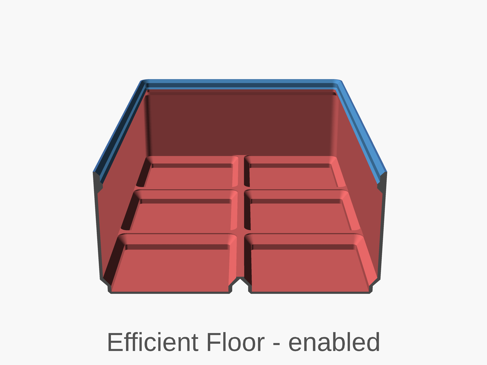

# Navigation Structure
{: .no_toc }

  

    Table of contents
  

  {: .text-delta }
- TOC
{:toc}

# General Cup Settings

Setting | Description
-|-
`width` | X dimension in grid units  (multiples of 42mm) options `[ 0.5, 1, 2, 3, 4, 5, 6, 7, 8, 9, 10, 11, 12, 13 ]`
`depth` | Y dimension in grid units (multiples of 42mm) options `[ 1, 2, 3, 4, 5, 6, 7, 8, 9, 10, 11, 12, 13 ]`
`height` | Height in Gridfinity height units (7mm) of the bin. Does not include the lip height which is about 4mm.
`filled_in` |  Fill in solid block (overrides all following options). Useful for generating a block to be later modified in OpenSCAD or exported and modified in another tool. `default = "off"` **Options** `off`: not filled in `on`: filled in but still stackable `notstackable`:filled in an not stackable 
`label` |  Include overhang for labeling.  `default=disabled` **Options** `disabled`: no label `left`: Left aligned `right`: Right aligned `center`: Center aligned `leftchamber`: One label per chamber, left aligned `rightchamber`: One label per chamber, right aligned `centerchamber`: One label per chamber, center aligned 
`label_width`| Width of the label in number of Gridfinity units (42mm), or zero means full width.
`wall_thickness` | thickness of the bin walls, Zack's design is 0.95 `default = 0.95`
`lip_style` |  Removes some or all of lip. `default = "normal"` **Options** `normal`: normal lip `reduced`: smaller lip `none`: no lip 
`position` |  x and y position of the rendered bin. Useful of planing to further edit the bin with another script. **options** `default`: Centers x1 and y1 `center`: centers the whole bin `zero`: Sets the lower left side of the bin on the zero mark

---

# Subdivisions

Setting | Description
-|-
`chambers` | Number of chambers in the X dimension, smallest value is 1, which means no dividers.
`irregular_subdivisions` | Enable irregular subdivisions. `default = false`
`separator_positions` | Separator positions are defined in terms of grid units from the left end.  Example `[0.25, 0.5, 1, 1.33, 1.66]`

---

# Base

Setting | Description
-|-
`magnet_diameter` | Zack's design uses magnet diameter of 6.5. 0 would disable the magnet hole.
`screw_depth` | Zack's design uses depth of 6. 0 would disable the screw hole.
`center_magnet_diameter` |  Magnet to be added to the center of a gridfinity cell. This is expected to be used to hold the items in the bin like screws in place. Diameter of the center magnet.
`center_magnet_thickness` | Thickness of the center magnet.
`hole_overhang_remedy` |  Sequential bridging for hanging hole. Only  active only when both screws and magnets are nonzero (and this option is selected). ref :[buried-nuts-and-hanging-holes](https://hydraraptor.blogspot.com/2014/03/buried-nuts-and-hanging-holes.html) ref: [How to 3D Print bores without supports (Fusion 360 Masterclass)](https://www.youtube.com/watch?v=KBuWcT8XkhA)
`box_corner_attachments_only` |  Only add attachments (magnets and screw) to box corners (prints faster).  `default = false`
`floor_thickness` |  Minimum thickness above cutouts in base (Zack's design is effectively 1.2). `default = 0.7`
`cavity_floor_radius`|  The radius between the wall and the floor. **Options** `-1`: default, matches the wall radius, `0`: no radius `>0`: sets the to provided value
`efficient_floor` |  Efficient floor option saves material and time, but the internal floor is not flat (only applies if no magnets, screws, or finger-slide used). `default = false`
`half_pitch` |  Subdivides the bottom pads in half, to allow half-cell offsets `default = false`
`flat_base` |  Removes the base grid from inside the shape `default = false`

---
# Finger Slide

{: .note }
**Finger Slide** does not work with **Efficient Floor**. **Finger Slide** does not work with **Wall Pattern**.

Setting | Description
-|-
`fingerslide` | Include larger base corner fillet, to allow easy removal of the items in the bin. `default = "none"` **Options** `none`: no finger slide `rounded`: rounded finger slide `chamfered`:45deg angled finger slide
`fingerslide_radius` | Radius of the corner fillet, `default = 8`

---
# Tapered Corner

Setting | Description
-|-
`tapered_corner` | style of the tapered corner. `default = "none"` **Options** `none`: no tapered corner `rounded`: rounded corner `chamfered`:45deg angled taper
`tapered_corner_size` | Size of the tapered corner, in both the x and y directions.`default = 10` '`-1`: sets the base of the Floor height.`0`: Sets the base to just above the inner corner round over.
`tapered_setback` | Set back of the tapered corner in to the box, default is the gridfinity corner radius `default = -1` results in `gridfinity_corner_radius/2`

---
# Wall Cutout

Setting | Description
-|-
`wallcutout_enabled` | `default=false`
`wallcutout_walls` | wall to enable on, front, back, left, right. I.E. [1,0,0,0] front only, [1,1,1,1] all walls.
`wallcutout_width` | `default = binwidth/2`
`wallcutout_angle` | `default = 70 deg`
`wallcutout_height` | `default = binHeight` '`-1`: Sets the base of the Floor height.`0`: Sets the base to just above the inner corner round over.
`wallcutout_corner_radius` | `default = 5`

---
# Wall Pattern

Setting | Description
-|-
`wallpattern_enabled` | Enables a grid pattern to be removed from the walls of the bin. `default=false`
`wallpattern_hexgrid` | Switches between a square and hex pattern `default=true` which is hex.
`wallpattern_walls` | Selects the walls to enable the wall pattern on. [front, back, left, right]. I.E. [1,0,0,0] front only, [1,1,1,1] all walls.
`wallpattern_fill` |  The pattern wont fill the space completely. These options allow for extending the patter to fill the space. Note, the pattern is rotated to make the hex shape easier to print. As such you need to swap vertical and horizontal. **Options** `none`: no fill `space`: Increase Space between grid to fill `crop`: Over fill and crop the the allowed space `crophorizontal`:Crop horizontal only `cropvertical`: Crop vertical only `crophorizontal_spacevertical`: Crop horizontal space vertical `cropvertical_spacehorizontal`: Crop vertical space horizontal `spacevertical`:Space vertical `spacehorizontal`:Space horizontal
`wallpattern_hole_sides` | Number of sides of the hole. **Options** `4`: square `6`: hexagon `64`: circle
`wallpattern_hole_size` | Size of the hole
`wallpattern_hole_spacing` | Spacing between pattern

---
# Debug

Setting | Description
-|-
`cutx` | Slice along the x axis, only active during preview.
`cuty` | Slice along the y axis, only active during preview.
`help` | Enables logging of help messages during render, also enables caliper measurements if `cutx` or `cuty` are enabled.

