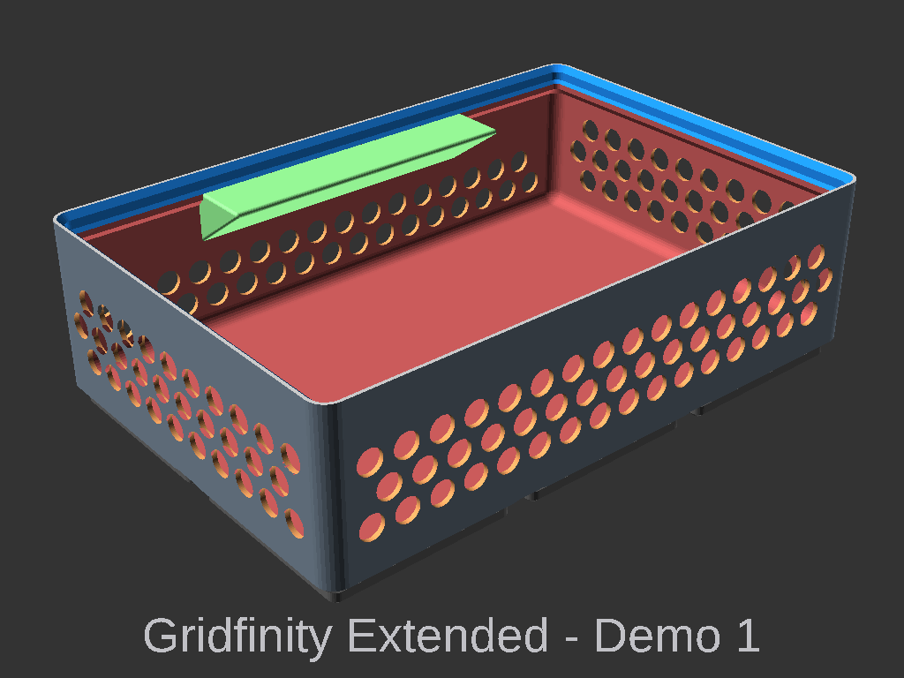

# Gridfinity Extended

  

    Table of contents
  

  {: .text-delta }
- TOC
{:toc}

## Overview

Gridfinity Extended is an OpenSCAD library originally based on Jamies library https://github.com/vector76/gridfinity_openscad
Built on this library are added base features and a customisable extended feature set.

Details of the [Gridfinity specifications](https://gridfinity.xyz/specification/) can be found on the official site https://gridfinity.xyz/.

## Repo
GitHub repo [ostat/gridfinity_openscad](https://github.com/ostat/gridfinity_extended_openscad)

## Added features included
Features added the the Base Gridfinity cups
  - Corner only magnets
  - Flat base
  - Customisable Finger slide
  - [Patterned walls](#wall-pattern)
  - [Wall cutout](#wall-cutout)
  - [Round box](#tapered-corner)

## Extended features
Extended features are features that build on the base bin but allow for unique options. These features also allow combining multiple extended features in to a single tray.

Options available
 - Item Holder    
 - Divider
 - [Tray]()
