# Navigation Structure
{: .no_toc }

  

    Table of contents
  

  {: .text-delta }
- TOC
{:toc}

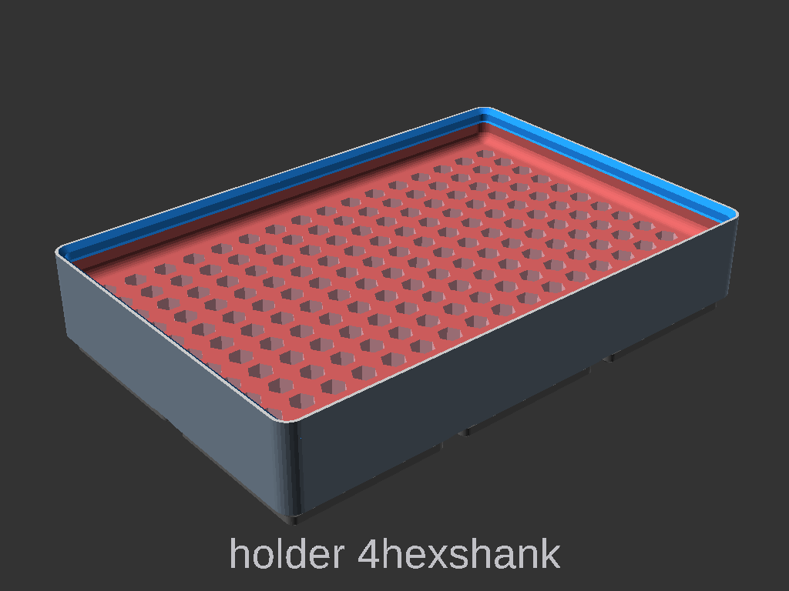

# Item Holder Settings

Setting | Description
-|-
`itemholder_known_item` | List of items to select from, including hex bit shanks and batteries. See list bellow [know items](#know-items).
`itemholder_known_cards` | List on Memory cards to select from. See list bellow [memory cards](#memory-cards).
`itemholder_known_cartridges` | List on Game cartridges to select from. See list bellow [cartridges](#cartridges).
`itemholder_hex_grid` | 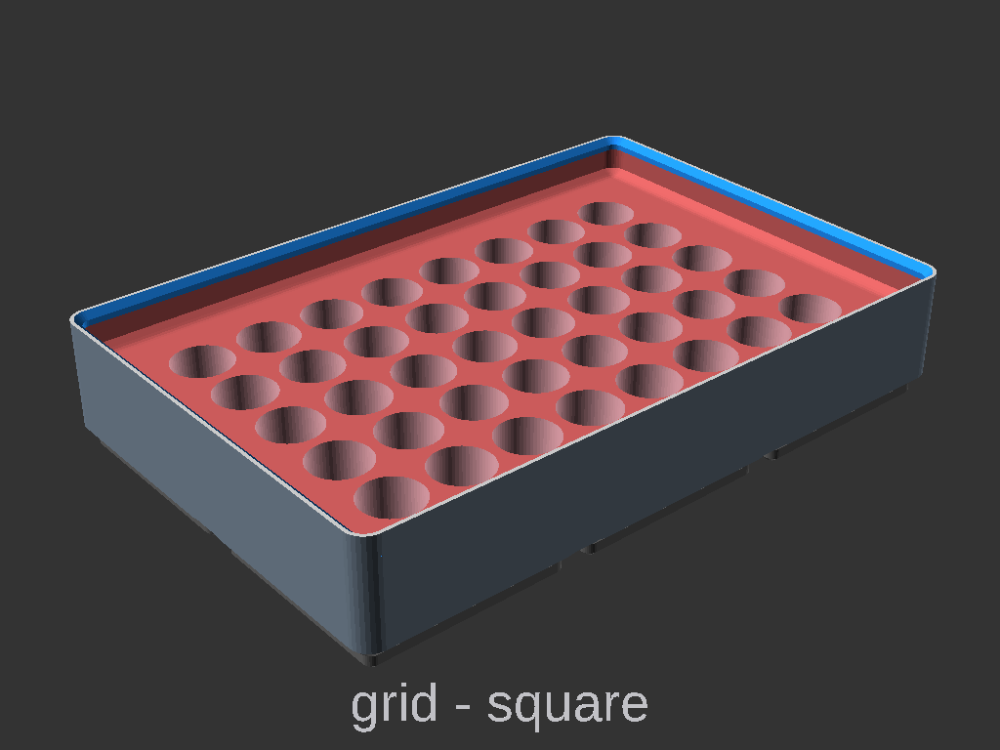 Should the grid be square or hex. Hex grid works well for round and hex shaped items, not so well for rectangle things.
`itemholder_hole_spacing` | 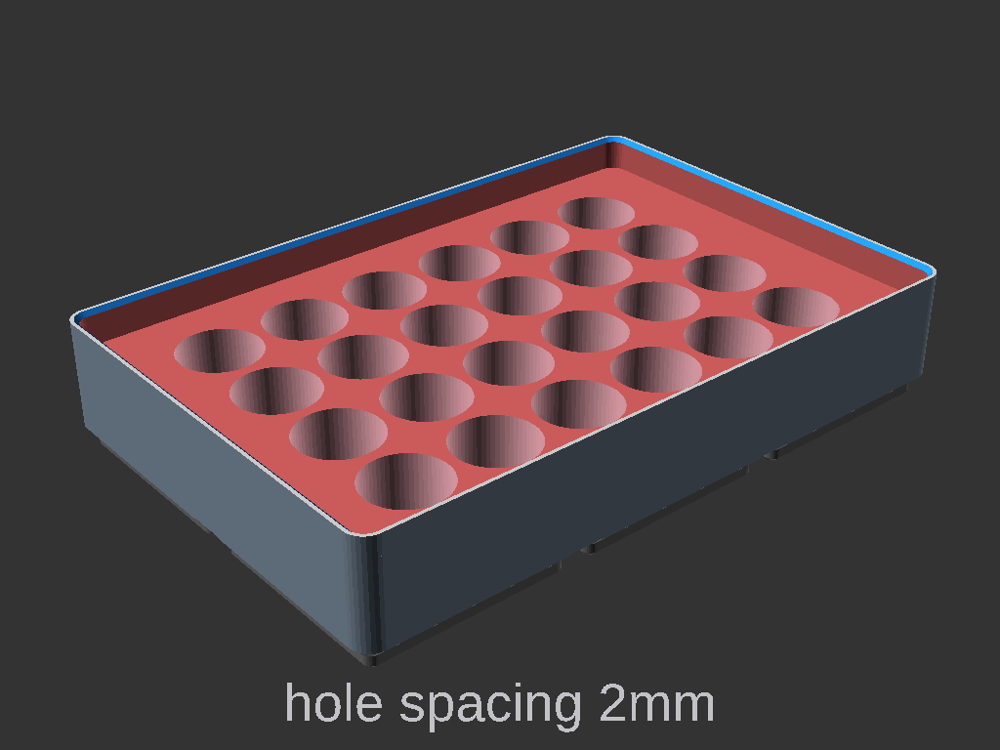 Spacing around the item holes. `default = 2`
`itemholder_hole_clearance` | 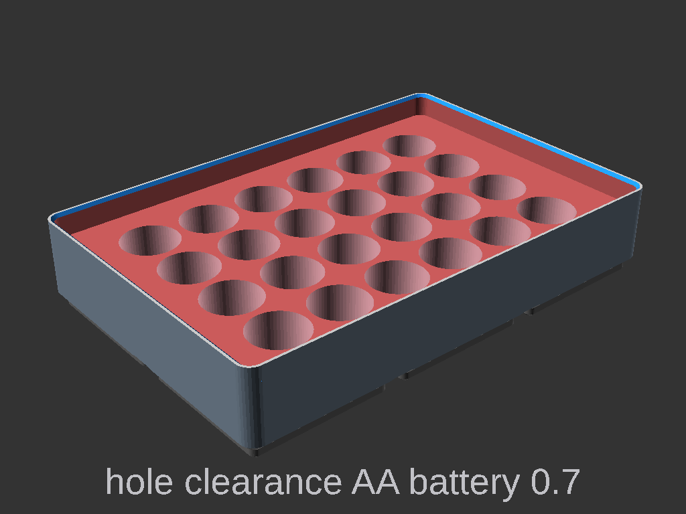 enlarges the holes by this amount for clearance. Know item lists have exact sizes, some clearance is needed. `default = 0.65`
`itemholder_hole_depth` | 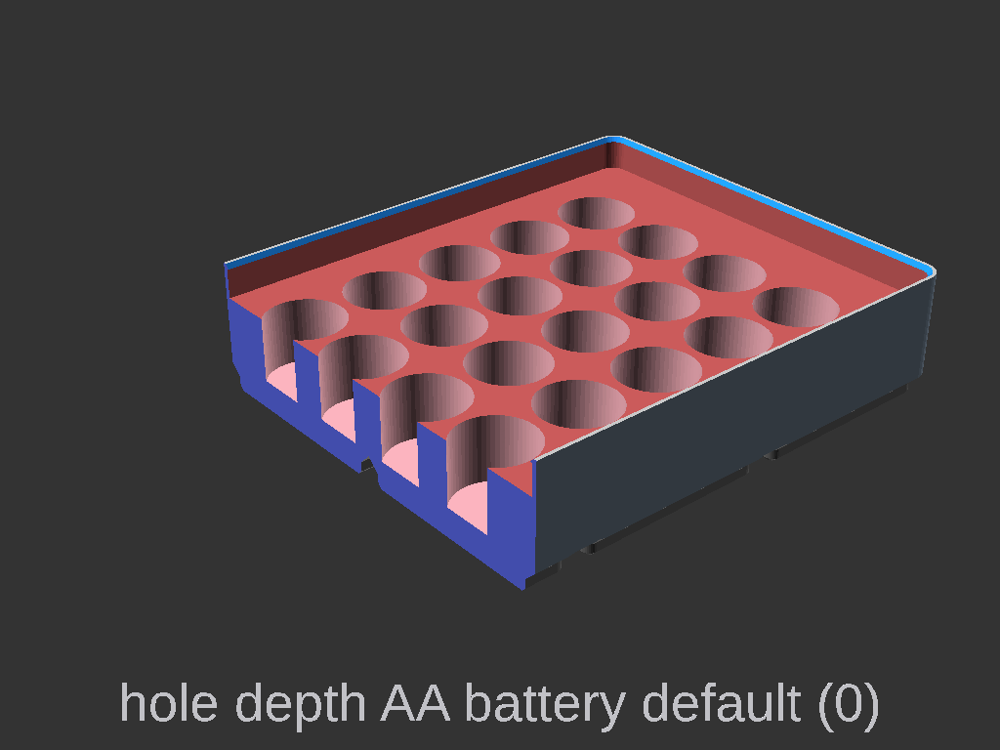 Depth of hole, Overrides the know item depth. Depth is limited by floor height.
`itemholder_hole_sides` | 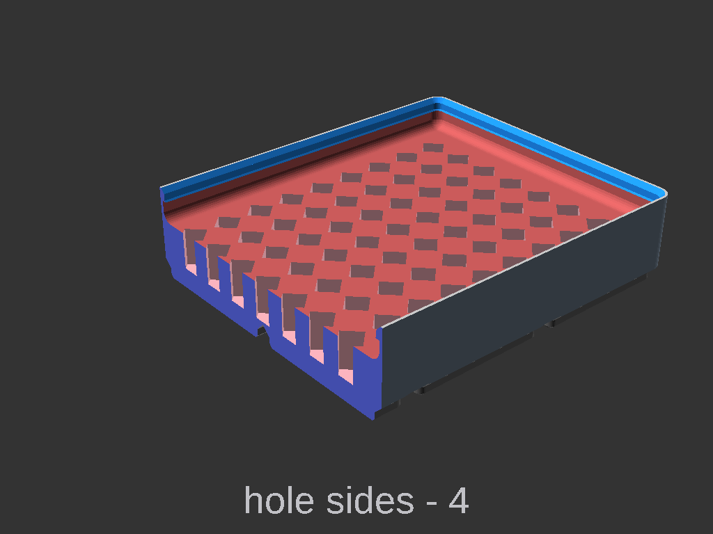 The number of sides for the hole, when custom is selected. Passed as the FN to a circle.
`itemholder_hole_size` | 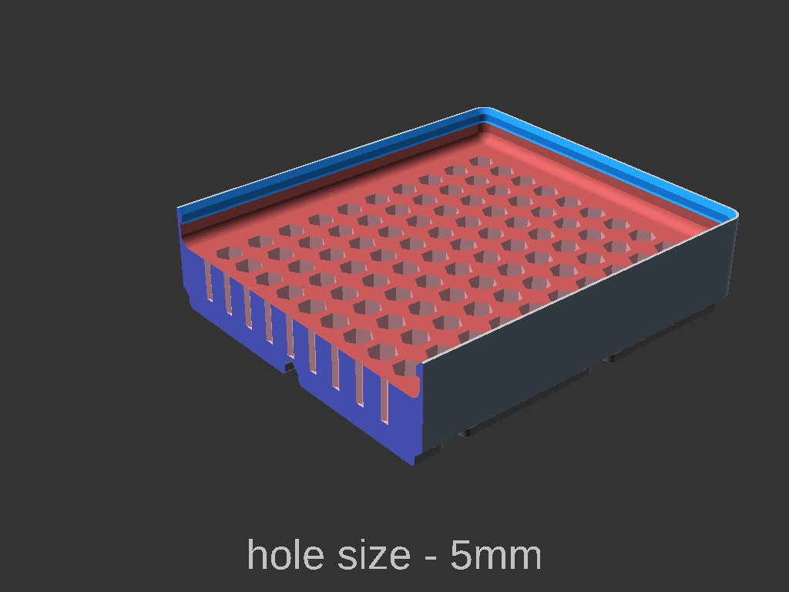 The size the hole (diameter), when custom is selected.
`itemholder_hole_gridx` | 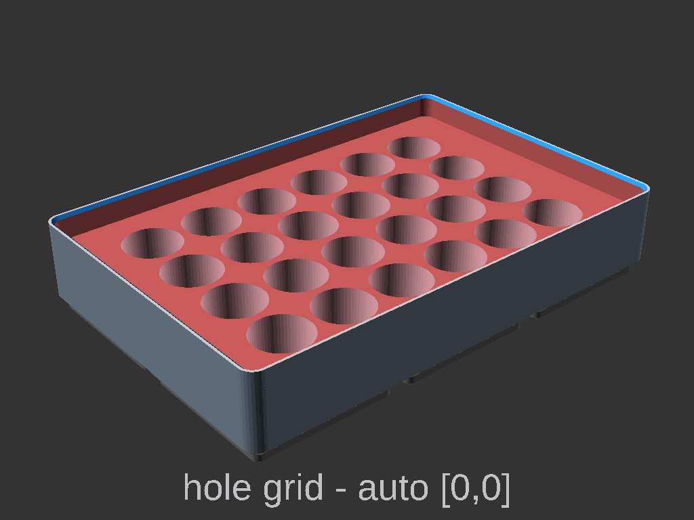 Number of items in the x axis. Override the dynamic calculated items, 0 = dynamic `default = 0`
`itemholder_hole_gridy` | Number of items in the y axis. Override the dynamic calculated items, 0 = dynamic. Half values (3.5) is only valid for hex grid. `default = 0`
`itemholder_auto_bin_height` |  Auto set the bin height and floor height based on the hole depth. Ensures that the item will fit.
`itemholder_compartments` | 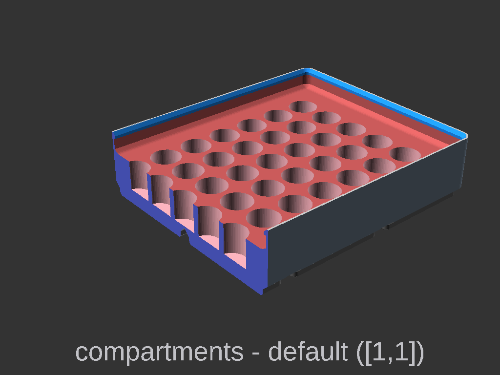 Number of compartments (group of items)  `default = [1,1]`;
`itemholder_compartment_spacing` | 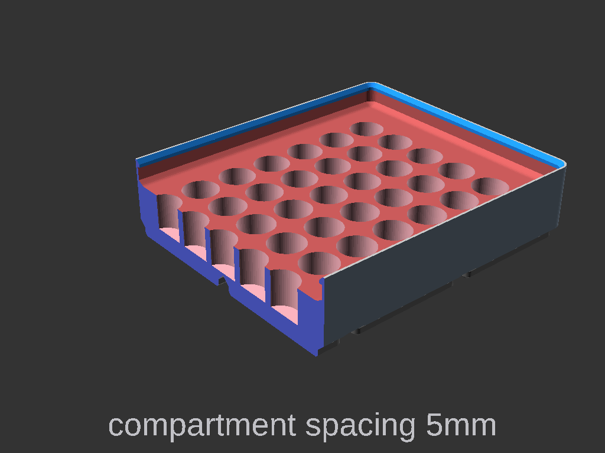 Spacing around the compartments, including the walls if its single compartment. `default = 3`
`itemholder_compartment_centered` |  Center the holes within the compartments. `default=true`
`itemholder_compartment_fill` | 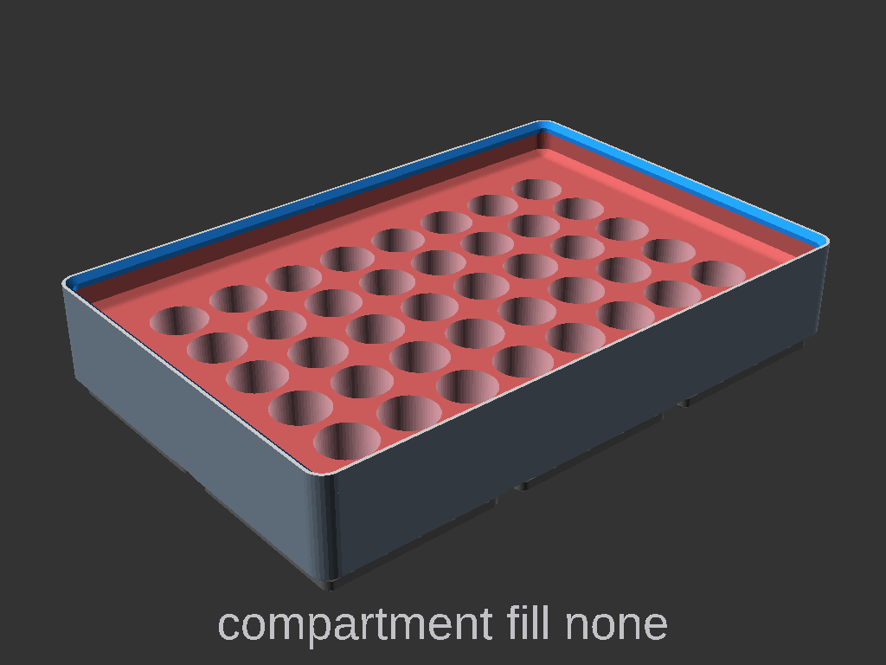  How to fill the compartment. `default = none` **Options** `none`: no fill, will use `itemholder_hole_spacing`. `space`: Space in increased to fill compartment. `crop`: Overfill an crop, not useful here.
`itemholder_customcompartments` | TBA

# know items
Dimensions used for the **know items** dropdowns. Please verify the Dimensions before printing using something like the measurement tool in Prusa Slicer. I didn't measure all of these, they were sourced from various places online.

## tools

Name | width | thickness | depth | Item height | shape | source |
--|--|--|--|--|--|--
`4hexshank` | 4 | 0 | 5 | 20 | hex |  |
`1/4hexshank` | 6.35 | 0 | 8 | 15 | hex |  |
`1/4hexshanklong` | 6.35 | 0 | 15 | 40 | hex |  |
`5/16hexshank` | 7.94 | 0 | 7 | 0 | hex |  |
`3/8hexshank` | 9.52 | 0 | 10 | 0 | hex |  |

## batteries

Name | width | thickness | depth | Item height | shape | source |
--|--|--|--|--|--|--
`aaaa` | 8.3 | 0 | 10.625 | 42.5 | round | https://en.wikipedia.org/wiki/List_of_battery_sizes |
`aaa` | 10.5 | 0 | 11.125 | 44.5 | round | https://en.wikipedia.org/wiki/List_of_battery_sizes |
`aa` | 14.5 | 0 | 12.625 | 50.5 | round | https://en.wikipedia.org/wiki/List_of_battery_sizes |
`c` | 26.2 | 0 | 12.5 | 50 | round | https://en.wikipedia.org/wiki/List_of_battery_sizes |
`d` | 34.2 | 0 | 15.375 | 61.5 | round | https://en.wikipedia.org/wiki/List_of_battery_sizes |
`7540` | 7.5 | 0 | 10 | 40 | round | https://en.wikipedia.org/wiki/List_of_battery_sizes |
`8570` | 8.5 | 0 | 17.5 | 70 | round | https://en.wikipedia.org/wiki/List_of_battery_sizes |
`10180` | 10 | 0 | 4.5 | 18 | round | https://en.wikipedia.org/wiki/List_of_battery_sizes |
`10280` | 10 | 0 | 7 | 28 | round | https://en.wikipedia.org/wiki/List_of_battery_sizes |
`10440` | 10 | 0 | 11 | 44 | round | https://en.wikipedia.org/wiki/List_of_battery_sizes |
`10850` | 10 | 0 | 21.25 | 85 | round | https://en.wikipedia.org/wiki/List_of_battery_sizes |
`13400` | 13 | 0 | 10 | 40 | round | https://en.wikipedia.org/wiki/List_of_battery_sizes |
`14250` | 14 | 0 | 6.25 | 25 | round | https://en.wikipedia.org/wiki/List_of_battery_sizes |
`14300` | 14 | 0 | 7.5 | 30 | round | https://en.wikipedia.org/wiki/List_of_battery_sizes |
`14430` | 14 | 0 | 10.75 | 43 | round | https://en.wikipedia.org/wiki/List_of_battery_sizes |
`14500` | 14 | 0 | 13.25 | 53 | round | https://en.wikipedia.org/wiki/List_of_battery_sizes |
`14650` | 14 | 0 | 16.25 | 65 | round | https://en.wikipedia.org/wiki/List_of_battery_sizes |
`15270` | 15 | 0 | 6.75 | 27 | round | https://en.wikipedia.org/wiki/List_of_battery_sizes |
`16340` | 16 | 0 | 8.5 | 34 | round | https://en.wikipedia.org/wiki/List_of_battery_sizes |
`16650` | 16 | 0 | 16.25 | 65 | round | https://en.wikipedia.org/wiki/List_of_battery_sizes |
`17500` | 17 | 0 | 12.5 | 50 | round | https://en.wikipedia.org/wiki/List_of_battery_sizes |
`17650` | 17 | 0 | 16.25 | 65 | round | https://en.wikipedia.org/wiki/List_of_battery_sizes |
`17670` | 17 | 0 | 16.75 | 67 | round | https://en.wikipedia.org/wiki/List_of_battery_sizes |
`18350` | 18 | 0 | 8.75 | 35 | round | https://en.wikipedia.org/wiki/List_of_battery_sizes |
`18490` | 18 | 0 | 12.25 | 49 | round | https://en.wikipedia.org/wiki/List_of_battery_sizes |
`18500` | 18 | 0 | 12.5 | 50 | round | https://en.wikipedia.org/wiki/List_of_battery_sizes |
`18650` | 18 | 0 | 16.25 | 65 | round | https://en.wikipedia.org/wiki/List_of_battery_sizes |
`20700` | 20 | 0 | 17.5 | 70 | round | https://en.wikipedia.org/wiki/List_of_battery_sizes |
`21700` | 21 | 0 | 17.5 | 70 | round | https://en.wikipedia.org/wiki/List_of_battery_sizes |
`25500` | 25 | 0 | 12.5 | 50 | round | https://en.wikipedia.org/wiki/List_of_battery_sizes |
`26500` | 26 | 0 | 12.5 | 50 | round | https://en.wikipedia.org/wiki/List_of_battery_sizes |
`26650` | 26 | 0 | 16.25 | 65 | round | https://en.wikipedia.org/wiki/List_of_battery_sizes |
`26700` | 26 | 0 | 17.5 | 70 | round | https://en.wikipedia.org/wiki/List_of_battery_sizes |
`26800` | 26 | 0 | 20 | 80 | round | https://en.wikipedia.org/wiki/List_of_battery_sizes |
`32600` | 32 | 0 | 15 | 60 | round | https://en.wikipedia.org/wiki/List_of_battery_sizes |
`32650` | 32 | 0 | 16.925 | 67.7 | round | https://en.wikipedia.org/wiki/List_of_battery_sizes |
`32700` | 32 | 0 | 17.5 | 70 | round | https://en.wikipedia.org/wiki/List_of_battery_sizes |
`38120` | 38 | 0 | 30 | 120 | round | https://en.wikipedia.org/wiki/List_of_battery_sizes |
`38140` | 38 | 0 | 35 | 140 | round | https://en.wikipedia.org/wiki/List_of_battery_sizes |
`40152` | 40 | 0 | 38 | 152 | round | https://en.wikipedia.org/wiki/List_of_battery_sizes |
`4680` | 46 | 0 | 20 | 80 | round | https://en.wikipedia.org/wiki/List_of_battery_sizes |

## Memory cards

Name | width | thickness | depth | Item height | shape | source
--|--|--|--|--|--|--
`compactflashi` | 43 | 3.3 | 9 | 36 | square | https://en.wikipedia.org/wiki/Comparison_of_memory_cards |
`compactflashii` | 43 | 5 | 9 | 36 | square | https://en.wikipedia.org/wiki/Comparison_of_memory_cards |
`smartmedia` | 37 | 0.76 | 11.25 | 45 | square | https://en.wikipedia.org/wiki/Comparison_of_memory_cards |
`mmc` | 24 | 1.4 | 8 | 32 | square | https://en.wikipedia.org/wiki/Comparison_of_memory_cards |
`mmcmobile` | 24 | 1.4 | 4.5 | 18 | square | https://en.wikipedia.org/wiki/Comparison_of_memory_cards |
`mmcmicro` | 14 | 1.1 | 3 | 12 | square | https://en.wikipedia.org/wiki/Comparison_of_memory_cards |
`sd` | 24 | 2.1 | 18 | 32 | square | https://en.wikipedia.org/wiki/Comparison_of_memory_cards |
`minisd` | 20 | 1.4 | 10 | 21.5 | square | https://en.wikipedia.org/wiki/Comparison_of_memory_cards |
`microsd` | 11 | 1 | 3.75 | 15 | square | https://en.wikipedia.org/wiki/Comparison_of_memory_cards |
`memorystickstandard` | 21.5 | 2.8 | 12.5 | 50 | square | https://en.wikipedia.org/wiki/Comparison_of_memory_cards |
`memorystickduo` | 20 | 1.6 | 7.75 | 31 | square | https://en.wikipedia.org/wiki/Comparison_of_memory_cards |
`memorystickmicro` | 12.5 | 1.2 | 3.75 | 15 | square | https://en.wikipedia.org/wiki/Comparison_of_memory_cards |
`nano` | 12.3 | 0.7 | 2.2 | 8.8 | square | https://en.wikipedia.org/wiki/Comparison_of_memory_cards |
`psvita` | 15 | 1.6 | 3.125 | 12.5 | square | https://en.wikipedia.org/wiki/Comparison_of_memory_cards |
`xqd` | 38.5 | 3.8 | 7.45 | 29.8 | square | https://en.wikipedia.org/wiki/Comparison_of_memory_cards |
`xD` | 25 | 1.78 | 5 | 20 | square | https://en.wikipedia.org/wiki/Comparison_of_memory_cards |
`USB A` | 12 | 4.5 | 12.8 | 13 | square |  |
`USB C` | 8.5 | 4 | 10 | 0 | square |  |

## Cartridges

Name | width | thickness | depth | Item height | shape | source
--|--|--|--|--|--|--
`atari800` | 68 | 21 | 19.25 | 77 | square | https://www.reddit.com/r/gamecollecting/comments/23stkf/q_dimensions_for_game_cartridges/ |
`atari2600` | 81 | 19 | 21.75 | 87 | square | https://www.reddit.com/r/gamecollecting/comments/23stkf/q_dimensions_for_game_cartridges/ |
`atari5200` | 104 | 20 | 28 | 112 | square | https://www.reddit.com/r/gamecollecting/comments/23stkf/q_dimensions_for_game_cartridges/ |
`atari7800` | 81 | 19 | 21.75 | 87 | square | https://www.reddit.com/r/gamecollecting/comments/23stkf/q_dimensions_for_game_cartridges/ |
`commodore` | 79 | 17 | 34.75 | 139 | square | https://www.reddit.com/r/gamecollecting/comments/23stkf/q_dimensions_for_game_cartridges/ |
`magnavoxodyssey` | 100 | 5.5 | 15 | 60 | square | https://www.reddit.com/r/gamecollecting/comments/23stkf/q_dimensions_for_game_cartridges/ |
`magnavoxodysseymulticard` | 105 | 15 | 27.5 | 110 | square | https://www.reddit.com/r/gamecollecting/comments/23stkf/q_dimensions_for_game_cartridges/ |
`magnavoxodyssey2` | 80 | 21 | 31.75 | 127 | square | https://www.reddit.com/r/gamecollecting/comments/23stkf/q_dimensions_for_game_cartridges/ |
`mattelintellivision` | 68 | 16 | 22 | 88 | square | https://www.reddit.com/r/gamecollecting/comments/23stkf/q_dimensions_for_game_cartridges/ |
`nintendofamicom` | 71 | 17 | 27 | 108 | square | https://www.reddit.com/r/gamecollecting/comments/23stkf/q_dimensions_for_game_cartridges/ |
`nintendofamicomdisk` | 76 | 4 | 22.5 | 90 | square | https://www.reddit.com/r/gamecollecting/comments/23stkf/q_dimensions_for_game_cartridges/ |
`nintendosuperfamicom` | 127 | 20 | 21.5 | 86 | square | https://www.reddit.com/r/gamecollecting/comments/23stkf/q_dimensions_for_game_cartridges/ |
`nes` | 120 | 17 | 33.5 | 134 | square | https://www.reddit.com/r/gamecollecting/comments/23stkf/q_dimensions_for_game_cartridges/ |
`snes` | 136 | 20 | 21.925 | 87.7 | square | https://www.reddit.com/r/gamecollecting/comments/23stkf/q_dimensions_for_game_cartridges/ |
`nintendo64` | 116 | 18 | 18.75 | 75 | square | https://www.reddit.com/r/gamecollecting/comments/23stkf/q_dimensions_for_game_cartridges/ |
`nintendogb` | 57 | 7.5 | 16.375 | 65.5 | square | https://www.reddit.com/r/gamecollecting/comments/23stkf/q_dimensions_for_game_cartridges/ |
`nintendogbc` | 57 | 9 | 16.375 | 65.5 | square | https://www.reddit.com/r/gamecollecting/comments/23stkf/q_dimensions_for_game_cartridges/ |
`nintendogba` | 35 | 6 | 14.25 | 57 | square | https://www.reddit.com/r/gamecollecting/comments/23stkf/q_dimensions_for_game_cartridges/ |
`nintendods` | 33 | 3.8 | 8.75 | 35 | square | https://www.reddit.com/r/gamecollecting/comments/23stkf/q_dimensions_for_game_cartridges/ |
`nintendo2ds` | 35 | 3.8 | 8.75 | 35 | square | https://www.reddit.com/r/gamecollecting/comments/23stkf/q_dimensions_for_game_cartridges/ |
`nintendovb` | 75 | 7 | 17 | 68 | square | https://www.reddit.com/r/gamecollecting/comments/23stkf/q_dimensions_for_game_cartridges/ |
`nintendoswitch` | 21 | 3 | 7.75 | 31 | square | https://www.reddit.com/r/gamecollecting/comments/23stkf/q_dimensions_for_game_cartridges/ |
`segagamegear` | 66 | 10 | 17 | 68 | square | https://www.reddit.com/r/gamecollecting/comments/23stkf/q_dimensions_for_game_cartridges/ |
`segagenesis` | 118 | 15 | 17 | 68 | square | https://www.reddit.com/r/gamecollecting/comments/23stkf/q_dimensions_for_game_cartridges/ |
`segagenesistall` | 96 | 16 | 22 | 88 | square | https://www.reddit.com/r/gamecollecting/comments/23stkf/q_dimensions_for_game_cartridges/ |
`segamegadrive` | 93 | 17 | 16.75 | 67 | square | https://www.reddit.com/r/gamecollecting/comments/23stkf/q_dimensions_for_game_cartridges/ |
`segamegadrivecodemasters` | 109 | 17 | 18.75 | 75 | square | https://www.reddit.com/r/gamecollecting/comments/23stkf/q_dimensions_for_game_cartridges/ |
`segamastersystem` | 69 | 17 | 27 | 108 | square | https://www.reddit.com/r/gamecollecting/comments/23stkf/q_dimensions_for_game_cartridges/ |
`sega32x` | 72 | 16 | 27.75 | 111 | square | https://www.reddit.com/r/gamecollecting/comments/23stkf/q_dimensions_for_game_cartridges/ |
`segacard` | 84 | 2 | 13.25 | 53 | square | https://www.reddit.com/r/gamecollecting/comments/23stkf/q_dimensions_for_game_cartridges/ |
`segapico` | 181 | 15 | 55.75 | 223 | square | https://www.reddit.com/r/gamecollecting/comments/23stkf/q_dimensions_for_game_cartridges/ |
`sonyumd` | 64 | 0 | 1.05 | 4.2 | round | https://www.reddit.com/r/gamecollecting/comments/23stkf/q_dimensions_for_game_cartridges/ |
`sonypsvita` | 22 | 2 | 7.5 | 30 | square | https://www.reddit.com/r/gamecollecting/comments/23stkf/q_dimensions_for_game_cartridges/ |
`sonypsvitamemcard` | 12.5 | 1.6 | 3.75 | 15 | square | https://www.reddit.com/r/gamecollecting/comments/23stkf/q_dimensions_for_game_cartridges/ |
`necpcehucard` | 53 | 2 | 21 | 84 | square | https://www.reddit.com/r/gamecollecting/comments/23stkf/q_dimensions_for_game_cartridges/ |
`snkneogeoaes` | 146.05 | 31.75 | 47.625 | 190.5 | square | https://www.reddit.com/r/gamecollecting/comments/23stkf/q_dimensions_for_game_cartridges/ |
`snkneogeomvs` | 145 | 35 | 46.25 | 185 | square | https://www.reddit.com/r/gamecollecting/comments/23stkf/q_dimensions_for_game_cartridges/ |
`bandai` | 41 | 6 | 16.5 | 66 | square | https://www.reddit.com/r/gamecollecting/comments/23stkf/q_dimensions_for_game_cartridges/ |
`msx` | 109 | 16.8 | 17.35 | 69.4 | square | https://www.reddit.com/r/gamecollecting/comments/23stkf/q_dimensions_for_game_cartridges/ |
