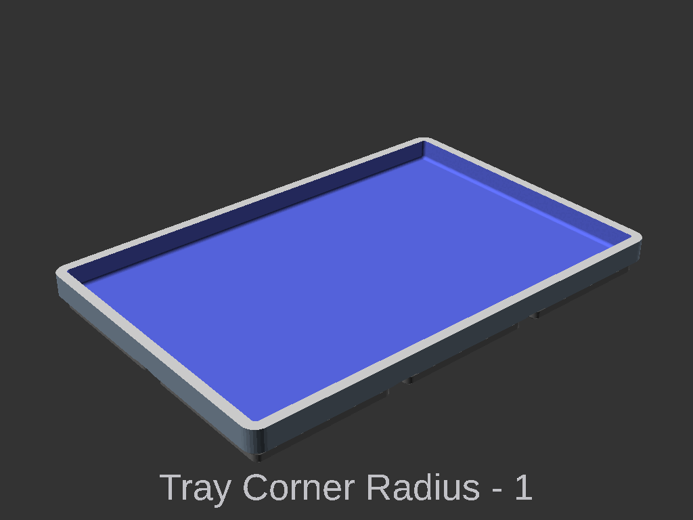
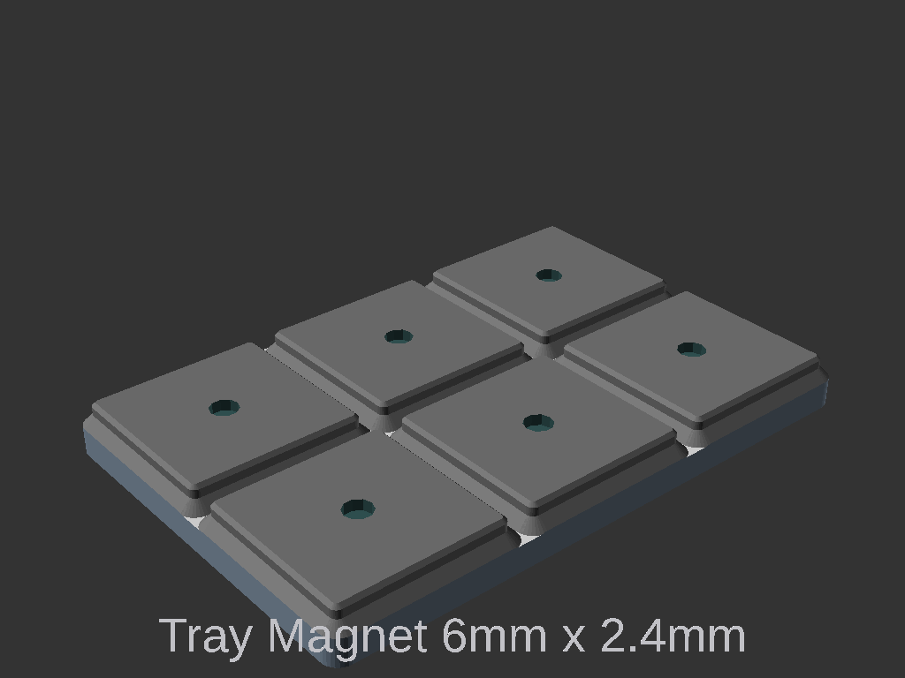
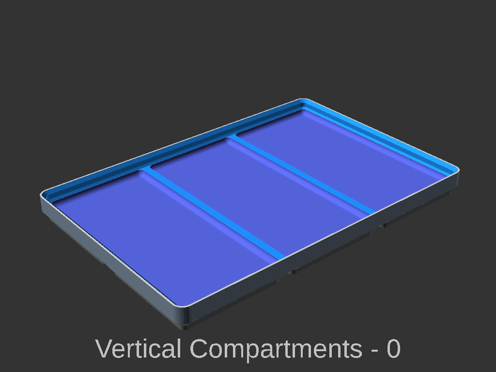
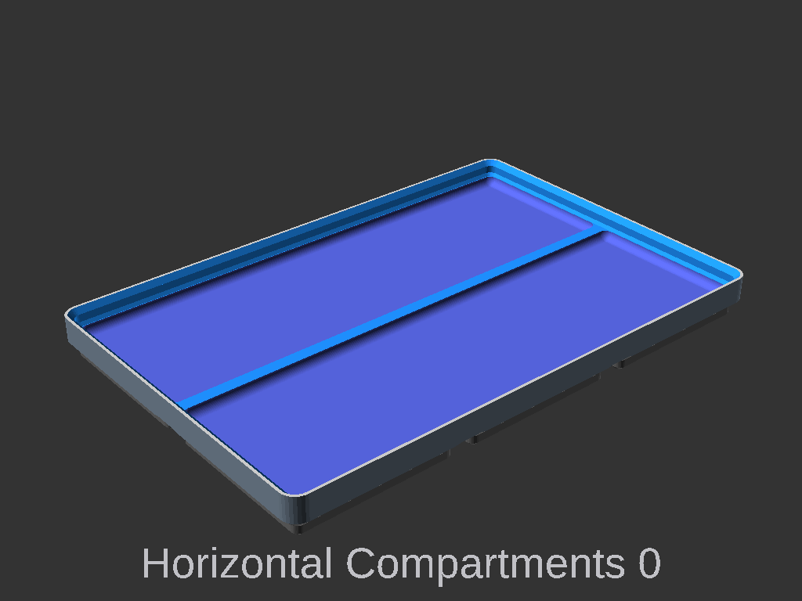
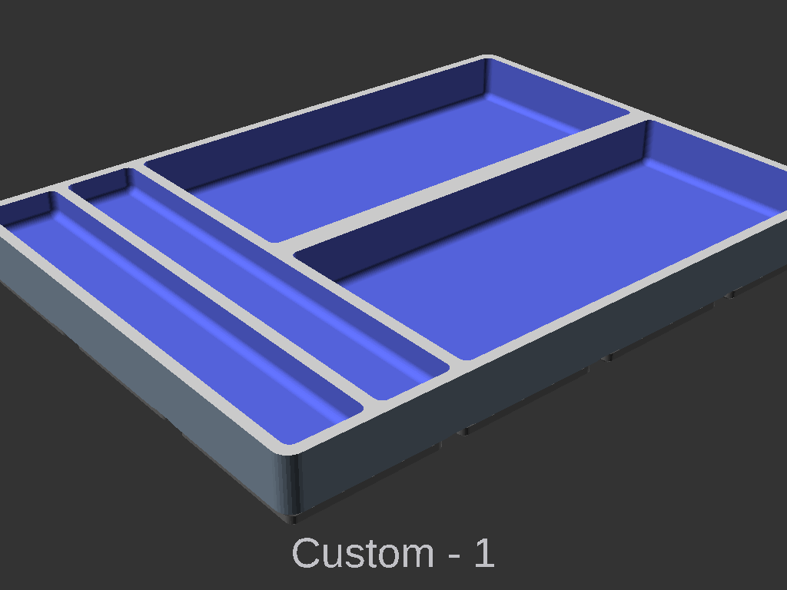
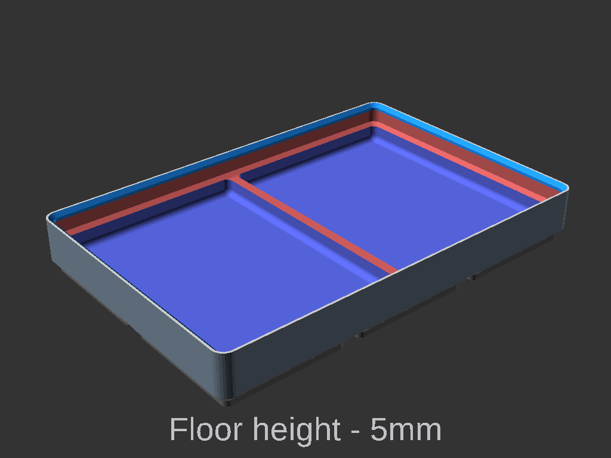
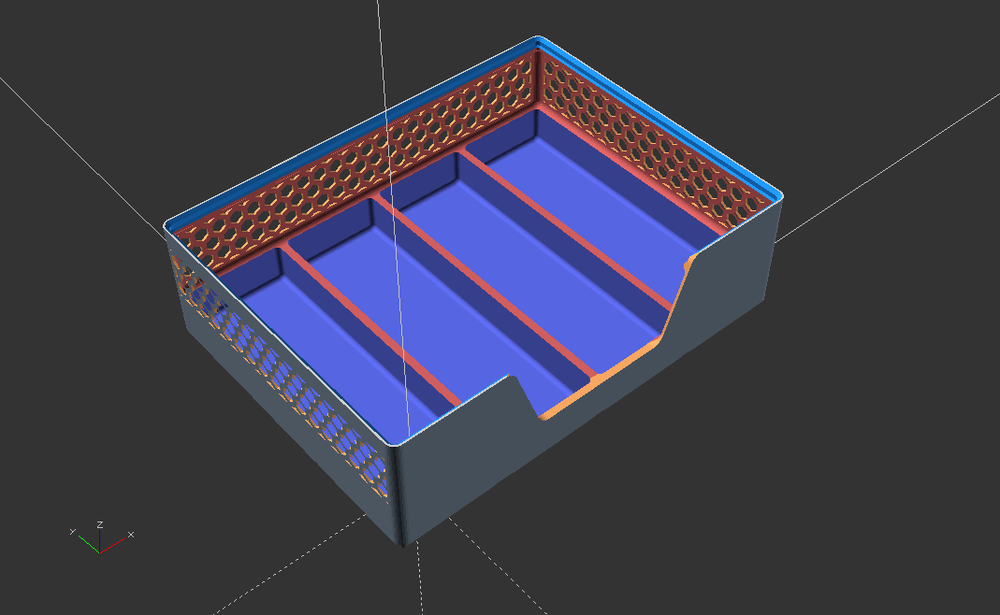

# Tray Extension
 
This extension adds a simple tray option to the basic cup.

Tray are rectangles with rounded corners that are removed from Gridfinity cup. Magnets can be included Under the tray (centred in the Gridfinity cell) that can keep small metal items from rolling away.

# Tray Settings

Setting | Description
-|-
`tray_corner_radius` |  
`tray_zpos` | The height from the bin base in mm.
`tray_magnet_thickness` |  Thickness of the magnet under the tray, centred in the Gridfinity cell.
`tray_magnet_radius` | Radius of the above cell centred magnet.
`tray_spacing` | Spacing between and around the trays.
`tray_vertical_compartments` |  Number of vertical compartments. `0` will provide one tray for each Gridfinity cell.
`tray_horizontal_compartments` |  Number of horizontal compartments. `0` will provide one tray for each Gridfinity cell.
`tray_custom_compartments` | Is a string field that is converted to an array of settings. This allows for multiple trays to be added to the cup, each with individual settings. See below for further details.

# Custom Compartments
 
Custom Compartments overrides and works with the above settings to allow multiple unique trays to be added.

The value is a string of comma separated (`,`) values for each tray. The trays are separated by pipe (`|`).
The values are provided in the order `xpos,ypos,xsize,ysize,radius,zpos`. 
 - xpos, ypos, the x/y position in Gridinity units.
 - xsize, ysize. the x/y size in Gridinity units. 
 - radius, [optional] corner radius in mm. If not provided the `tray_corner_radius` is used.
 - zpos, [optional] the height from the bin base in mm. If not provided the `tray_zpos` is used.
 - example `0,0,2,1|2,0,2,1,2,5`

# Tray and Basic Cup
Using `height`, `floor_thickness` and `filled_in` settings from the **Basic Cup** allows control of how deep the tray will be. 
 

The tray can be used with the other Gridfinity Basic Cup settings to enable further customisation to suit specific needs. 
 